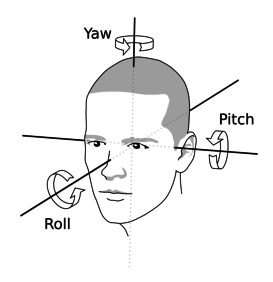
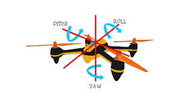

# Gesture-Based-Drone-Controller
Simulating a drone controller using head pose estimation and facial landmark detection.

## Simulator In Action


## Python Packages Required
* cv2
* dlib
* numpy
* pynput

## Steps
1. Open *Assets/RealSimulEnv* scene in Unity, and click on Run to start the simulator.
2. Use the following command to run the python based controller script (make sure that you are in *./Python Scripts/* directory):
  ```
  python PoseEstimatorAndController.py
  ```
3. Focus back on the Game Tab in Unity. *Move your head to control the roll, pitch and yaw of the drone in accordance to the given diagrams. Open mouth for upward thrust*.

 



**The PoseEstimatorAndController.py script requires *shape_predictor_68_face_landmarks.dat* file for facial landmark prediction. You can download it from [here](https://github.com/davisking/dlib-models/blob/master/shape_predictor_68_face_landmarks.dat.bz2)**

## References And Resources:
- [Head Pose Estimation Using OpenCV and DLib](https://www.learnopencv.com/head-pose-estimation-using-opencv-and-dlib/)
- [Bumble Bee Drone 3D Model](https://sketchfab.com/3d-models/bumble-bee-drone-electric-29d263461d1f4b73821d4c2e8fe995f5)


